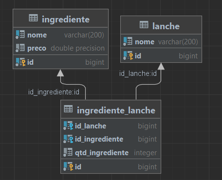

## Sobre o Projeto

O objetivo deste projeto é criar um MVP da aplicação utilizada para gerenciar o fictício restaurante "O Saboroso".

Atualmente, o foco está em estabelecer as bases de sua infraestutura e desenvolver um CRUD das entidades <i>Ingrediente</i> e <i>Lanche</i>; de modo que
o usuário possa operar sobre elas seguindo regras de negócio estabelecidas <a href="sobre_o_saboroso.pdf">aqui</a>.


## Principais Tecnologias Utilizadas
| Tecnologia                                     | Objetivo                                                                                                                                                             | Localização/Configuração              | 
|------------------------------------------------|----------------------------------------------------------------------------------------------------------------------------------------------------------------------|---------------------------------------|
| Git                                            | Realizar o controle de versão utilizando o <a href="https://medium.com/trainingcenter/utilizando-o-fluxo-git-flow-e63d5e0d5e04">git flow</a> como fluxo de trabalho. | -                                     |
| Java 8                                         | Ser a linguagem principal de escrita do backend (classes, métodos, interfaces, manipulação de estruturas de dados etc)                                               | -                                     | 
| Ecossistema Spring - Data JPA, Boot e Security | Gerenciar transações, facilitar o mapeamento ORM e esabelecer a segurança.                                                                                           | -                                     |
| Maven                                          | Realizar o gerenciamento de dependências.                                                                                                                            | -                                     |
| Liquibase                                      | Gerenciar mudanças no banco de dados, destacando quais colunas, tabelas, views, restriçoes etc foram removidas, alteradas ou adicionadas.                            | ```src/main/resources/db/changelog``` |
| Docker                                         | Virtualizar o contêiner do banco de dados PostgreSQL.                                                                                                                | ``` docker-compose.yml```             | 

## Diagrama Lógico de Dados



Como se pode deduzir da especificação, há um relacionamento ```m:n``` entre as entidades
*Ingrediente* e *Lanche*; representado aqui pela tabela ```core.ingrediente_lanche```.

## Como rodar

Clone o repositório do projeto em uma pasta de sua preferênia:

```
git clone https://github.com/ngm1450/saboroso-backend
```

Instale as dependências do maven:

```
mvn clean install
```

Suba o contêiner do banco de dados:

```
docker-compose up --build -d
```

Enfim, execute o projeto:

```
mvn spring-boot:run
```

(Obs: Manipualação do maven e execução podem ser facilitadas ao se utilizar um IDE como IntelliJ ou Eclipse.)